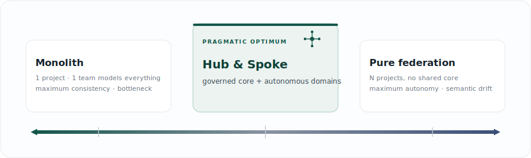
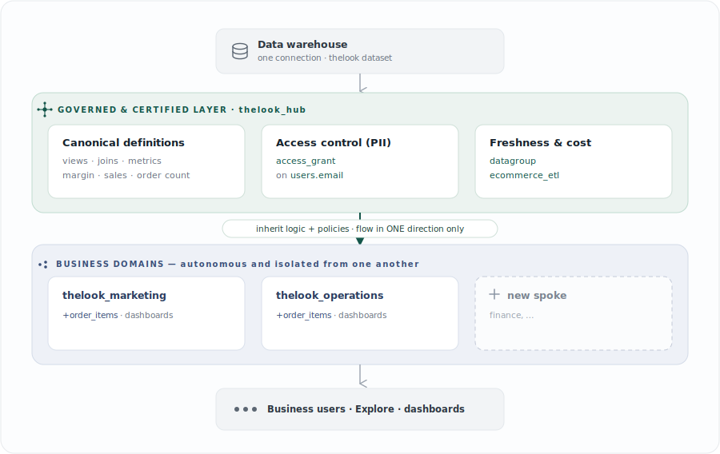
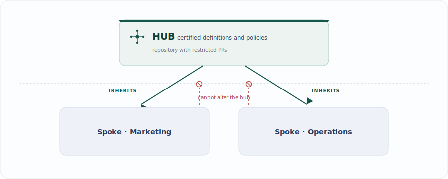

**English** · [Espa&ntilde;ol](README.md)

# TheLook · Hub & Spoke Model in Looker
### A governed semantic layer: governance by construction, not by convention

Data governance doesn't fail for lack of rules; it fails because rules that depend on human discipline don't scale at the pace of team autonomy. This project takes a different thesis: **turn governance from a process you have to remember into a property of the architecture that can't be silently bypassed**. The *hub* concentrates the certified definitions and policies; each *spoke* (domain) inherits them as a starting point and builds on top, with no way to contradict them by accident or globally. Built on the `thelook` dataset as a fork-ready reference implementation.

---

## The dilemma: control vs. autonomy

Every analytics organization swings between two imperfect extremes. **Centralizing** the modeling guarantees consistency, but it turns the data team into a bottleneck and pushes domains toward *shadow analytics* (everyone with their own spreadsheet). **Decentralizing** it brings speed, but produces semantic drift —each team redefines "sales"—, PII governed in scattered ways, and irreconcilable metrics across departments.

The interesting design problem isn't to pick an extreme, but to **get consistency and autonomy at the same time**. Hub & spoke is the pragmatic answer to that dilemma on a semantic layer like LookML.

---

## The design space

Hub & spoke isn't the only possible topology: it's a deliberate choice within a spectrum that runs from maximum control to maximum autonomy.

<p align="center">
  
</p>
<div align="center"><sub>← more control&nbsp;&nbsp;·&nbsp;&nbsp;more autonomy →</sub></div>

How each model behaves against the dimensions that actually matter in governance:

| Model | Semantic consistency | Team autonomy | Cross-domain isolation | Non-bypassable PII | Operational cost |
|---|---|---|---|---|---|
| Monolith (1 project) | High | Low | Low | High | Low |
| **Hub & Spoke** | **High** (for certified) | **Medium-high** | **High** | **High** | **Medium** |
| Pure federation (N, no hub) | Low (drift) | High | High | Low (scattered) | Medium |
| Data mesh | Medium-high (contracts) | High | High | Medium (federated) | High |

Against **data mesh** —an organizational paradigm where each domain publishes data as a product under federated computational governance—, hub & spoke can be read as its lightweight expression on a single platform: the hub *is* the computational-governance layer and the spokes are the domains. For a single Looker instance and a mid-to-large organization, it captures most of the benefit at a fraction of the operational cost.

---

## Architecture of the solution

<p align="center">
  
</p>

---

## The central thesis: governance by construction

The difference that holds everything else up is subtle but decisive. **Governance by convention** —style guides, PR checklists, "please use the certified field"— degrades because it depends on human vigilance and has no enforcement point at the seam between teams: divergence happens silently (someone writes their own SQL in a *Look*) and drift accumulates globally.

**Governance by construction** replaces it with invariants the system enforces. In this model, the certified definitions and policies are the *default* and the shared baseline; any divergence by a spoke is, by design:

1. **explicit and visible** in that spoke's code —never an oversight or an accident—,
2. **local** to that spoke —bounded blast radius—, and
3. **unable to corrupt** the hub or another domain.

Policies stop being an agreement and become **code**. Access control on `users.email` can't be bypassed by omission: a spoke doesn't redefine it, it inherits it already governed; weakening it would require an explicit, reviewable override —exactly where review should concentrate—, and the ultimate access decision (the user attribute) is controlled by the admin, not by the spoke's LookML.

<p align="center">
  
</p>
<div align="center"><sub>The hub's code is read-only to the spokes, which are also isolated from one another.</sub></div>

---

## How it's realized (the evidence, in the code)

Every governance benefit is anchored to a concrete piece of the repository.

- **A single source of truth for every metric.** Gross margin, sales, and order count are defined once in `hub/views/order_items.view.lkml`, and both spokes consume them without redefining. If the definition changes, it changes for everyone at once, from a single auditable point with a single Git history. No more "your revenue doesn't match mine."
- **Non-bypassable, centralized PII.** `users.email` carries `required_access_grants: [can_see_email]` in the hub. Operations uses it in its delayed-orders report, but inherits the lock; no domain can expose it on its own without an explicit, visible act.
- **Bounded blast radius + deliberate versioning.** The one-way flow isolates spokes from one another, and each pins the hub version it consumes (`ref` to a commit SHA) to update in a controlled way. One domain's experiment never breaks everyone else's metrics.
- **Freshness and cost as a central decision.** The caching and refresh policy (`datagroup ecommerce_etl`) is defined in the hub and applied uniformly via `persist_with`: nobody queries stale data by accident or hammers the warehouse with mismatched policies.
- **End-user trust.** Each person sees only the explores for their domain (without the noise of others' experiments), and every certified metric carries its `description`, so the business knows what it measures and where it comes from.
- **The central team scales without being a bottleneck.** It governs the core (definitions, access, freshness) and delegates domain logic to the areas: strong control and autonomy, at the same time.

---

## Costs, limits, and anti-patterns

An honest architectural choice also states what it costs and when it doesn't apply.

- **Operational overhead.** Multiple repositories, import credentials (deploy keys), and the *Update Dependencies* cycle add friction versus a monolith. It's a real cost that only pays off once there are several domains with divergent needs.
- **Learning curve.** *Refinements* and the order of `include`s (the base explore must precede its refinement; no wildcards where order matters) require training. Document the pattern and train the spoke developers.
- **The "obese hub" anti-pattern.** Pushing single-domain logic into the hub reintroduces the coupling the model is meant to eliminate. Rule: only what's **cross-cutting and certified** is promoted to the hub; a metric used by a single team lives in its spoke.
- **The versioning tension.** A branch `ref` propagates changes instantly (agile but fragile); a pinned commit SHA gives stability at the cost of deliberate *upgrades*. In production, a pinned SHA with reviewed updates is usually preferred.
- **Who governs the hub?** The hub doesn't govern itself. It needs an explicit owner (a platform or *enablement* team), a contribution model (PRs and, for larger changes, RFCs), and a service commitment. Without that operating model, it degenerates into a bottleneck or into neglect: governance is **socio-technical** —the architecture enforces the rules, but people decide which ones.
- **When NOT to use it.** With a single team, a nascent instance, or domains with no shared semantics, the monolith (or pure federation) is the right call. The overhead isn't justified until consistency across several teams becomes a tangible problem.

---

## How the repository is organized

A didactic monorepo: each top-level folder becomes **an independent Looker project** and, in production, **its own Git repository**.

| Folder | Looker project | Role |
|---|---|---|
| `hub/` | `thelook_hub` | Views, base explore, governance (PII + caching), constants |
| `spoke-marketing/` | `thelook_marketing` | Sales/marketing queries + dashboard |
| `spoke-operations/` | `thelook_operations` | Logistics queries + dashboard |

```
hub/
  manifest.lkml                  project_name + constants (connection, dataset)
  thelook_hub.model.lkml         corporate connection · access_grant · datagroup
  views/                         reusable base views (governed PII on users.email)
  explores/order_items.explore   base explore + joins (spokes refine it)
spoke-marketing/ · spoke-operations/
  manifest.lkml                  remote_dependency -> thelook_hub
  *.model.lkml                   imports the hub + refinements + dashboards
  queries/…                      explore: +order_items { query: … }
  dashboards/…                   the domain's LookML dashboards
```

---

## Getting started

### Option A — Production (3 repos, recommended)
1. Fork this repo and split it into three repositories (one per folder); each folder's contents go at the **root** of its repo.
2. Create **3 LookML projects** in Looker and connect them to their repos via Git.
3. **Lock down the hub:** protect its branch and limit PRs to a small group of developers.
4. In each spoke, set the `remote_dependency` URL (already included) and the `ref` (branch, tag, or **commit SHA** for pinned versioning).
5. **Credentials (private repos):** in the spoke's IDE, **Settings → Import Credentials**, copy the SSH deploy key and add it to the hub repo. Validate.
6. Click **Update Dependencies** to pull the hub files (this generates `manifest_lock.lkml`, which **is** committed).
7. Set `connection:` in each spoke model. If your dataset isn't `thelook`, override it per spoke with `override_constant: dataset { value: "my_dataset" }`.
8. Create the `can_see_email` user attribute (Admin → User Attributes) and set it to `yes` only for those who should see emails.
9. Validate and deploy each spoke.

### Option B — Single instance (faster for a demo)
Comment out `remote_dependency` and use `local_dependency: { project: "thelook_hub" }` in each spoke's manifest. Versioning becomes dynamic: hub changes are reflected instantly, ideal for validating hub and spoke together before production.

---

## What to adjust before validating
- **Connection:** `connection:` in each spoke `*.model.lkml`.
- **Dataset/schema:** defaults to `thelook` (in `hub/manifest.lkml`); change it there or per spoke with `override_constant`.
- **SQL dialect:** the views' date functions (`timestamp_diff`, `current_timestamp`) are written for **BigQuery**; adjust them if you use another engine.
- **Governance:** create the `can_see_email` user attribute so the PII control takes effect.

---

## Queries each spoke ships with

| Spoke | Query | What it answers |
|---|---|---|
| Marketing | `high_value_geos` | States with the highest gross margin (90 days) |
| Marketing | `year_over_year` | Monthly sales compared year over year (4 years) |
| Operations | `shipments_status` | Shipment-pipeline status by day |
| Operations | `inventory_aging` | Inventory volume by stock age |
| Operations | `severely_delayed_orders` | Orders in *Processing* > 3 days (uses governed PII) |

---

## Adding a new spoke (e.g., Finance)
Create `spoke-finance/` with its `manifest.lkml` (`project_name: "thelook_finance"`) importing the hub, a `finance.model.lkml` that includes the hub's views and base explore (`//thelook_hub/…`), and then its refinements file with the domain's KPIs. The governed core stays untouched; the design space remains intact.
