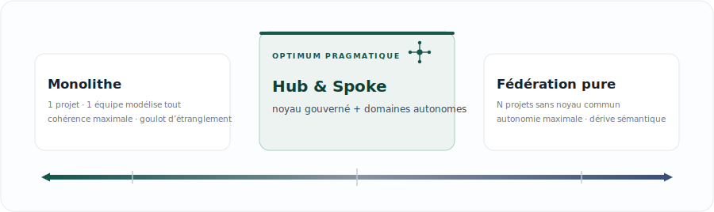
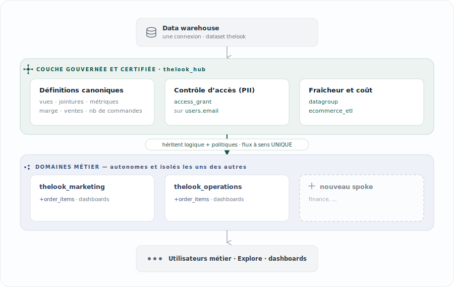
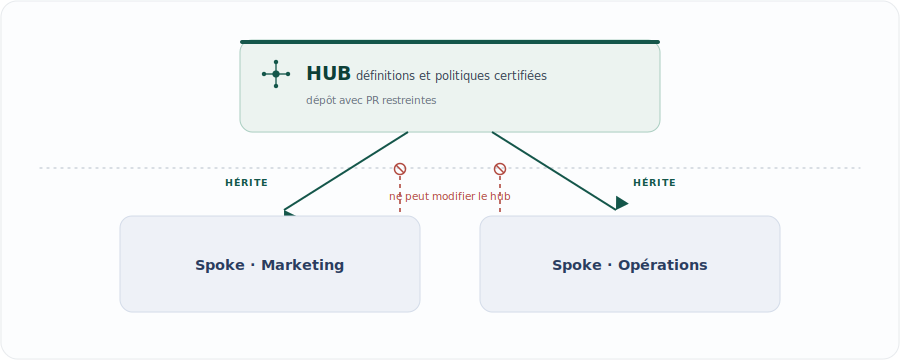

[English](README.en.md) · [Español](README.md) · **Français**

# TheLook · Modèle Hub & Spoke dans Looker
### Une couche sémantique gouvernée : la gouvernance par construction, pas par convention

La gouvernance des données n'échoue pas par manque de règles, mais parce que les règles qui reposent sur la discipline humaine ne passent pas à l'échelle au rythme de l'autonomie des équipes. Ce projet part d'une thèse différente : **transformer la gouvernance d'un processus dont il faut se souvenir en une propriété de l'architecture, impossible à contourner en silence**. Le *hub* concentre les définitions et les politiques certifiées ; chaque *spoke* (domaine) en hérite comme point de départ et construit par-dessus, sans pouvoir les contredire par accident ni globalement. Implémenté sur le dataset `thelook`, comme implémentation de référence prête à forker.

---

## Le dilemme : contrôle contre autonomie

Toute organisation analytique oscille entre deux extrêmes imparfaits. **Centraliser** la modélisation garantit la cohérence, mais transforme l'équipe data en goulot d'étranglement et pousse les domaines vers le *shadow analytics* (chacun avec son tableur). **Décentraliser** apporte de la vitesse, mais produit une dérive sémantique — chaque équipe redéfinit « les ventes » —, une PII gouvernée de façon dispersée et des métriques irréconciliables entre départements.

Le problème de conception intéressant n'est pas de choisir un extrême, mais d'**obtenir la cohérence et l'autonomie à la fois**. Hub & spoke est la réponse pragmatique à ce dilemme sur une couche sémantique comme LookML.

---

## L'espace de conception

Hub & spoke n'est pas la seule topologie possible : c'est un choix délibéré au sein d'un spectre qui va du contrôle maximal à l'autonomie maximale.

<p align="center">
  
</p>
<div align="center"><sub>← plus de contrôle&nbsp;&nbsp;·&nbsp;&nbsp;plus d'autonomie →</sub></div>

Le comportement de chaque modèle face aux dimensions qui comptent vraiment en gouvernance :

| Modèle | Cohérence sémantique | Autonomie des équipes | Isolation entre domaines | PII non contournable | Coût opérationnel |
|---|---|---|---|---|---|
| Monolithe (1 projet) | Élevée | Faible | Faible | Élevée | Faible |
| **Hub & Spoke** | **Élevée** (sur le certifié) | **Moyenne-élevée** | **Élevée** | **Élevée** | **Moyen** |
| Fédération pure (N sans hub) | Faible (dérive) | Élevée | Élevée | Faible (dispersée) | Moyen |
| Data mesh | Moyenne-élevée (contrats) | Élevée | Élevée | Moyenne (fédérée) | Élevé |

Face au **data mesh** — un paradigme organisationnel où chaque domaine publie ses données comme un produit sous une gouvernance computationnelle fédérée —, hub & spoke peut se lire comme son expression légère sur une seule plateforme : le hub *est* la couche de gouvernance computationnelle et les spokes sont les domaines. Pour une seule instance Looker et une organisation de taille moyenne à grande, il capture l'essentiel du bénéfice pour une fraction du coût opérationnel.

---

## Architecture de la solution

<p align="center">
  
</p>

---

## La thèse centrale : la gouvernance par construction

La différence qui soutient tout le reste est subtile mais décisive. La **gouvernance par convention** — guides de style, checklists de PR, « merci d'utiliser le champ certifié » — se dégrade parce qu'elle dépend de la vigilance humaine et n'a aucun point d'application à la couture entre les équipes : la divergence se produit en silence (quelqu'un écrit son propre SQL dans un *Look*) et la dérive s'accumule globalement.

La **gouvernance par construction** la remplace par des invariants que le système impose. Dans ce modèle, les définitions et politiques certifiées sont le *défaut* et la base commune ; toute divergence d'un spoke est, par conception :

1. **explicite et visible** dans le code de ce spoke — jamais un oubli ni un accident —,
2. **locale** à ce spoke — rayon d'impact borné —, et
3. **incapable de corrompre** le hub ou un autre domaine.

Les politiques cessent d'être un accord et deviennent du **code**. Le contrôle d'accès sur `users.email` ne peut pas être contourné par omission : un spoke ne le redéfinit pas, il en hérite déjà gouverné ; l'affaiblir exigerait une surcharge explicite et révisable — précisément là où la revue doit se concentrer —, et la décision d'accès finale (l'attribut utilisateur) est contrôlée par l'administrateur, pas par le LookML du spoke.

<p align="center">
  
</p>
<div align="center"><sub>Le code du hub est en lecture seule pour les spokes, eux-mêmes isolés les uns des autres.</sub></div>

---

## Comment cela se concrétise (la preuve, dans le code)

Chaque bénéfice de gouvernance est ancré à une pièce concrète du dépôt.

- **Une source unique de vérité pour chaque métrique.** La marge brute, les ventes et le nombre de commandes sont définis une seule fois dans `hub/views/order_items.view.lkml`, et les deux spokes les consomment sans les redéfinir. Si la définition change, elle change pour tout le monde à la fois, depuis un point unique et auditable, avec un seul historique Git. Fini le « ton revenue ne colle pas avec le mien ».
- **PII non contournable, centralisée.** `users.email` porte `required_access_grants: [can_see_email]` dans le hub. Les Opérations l'utilisent dans leur rapport de commandes en retard, mais héritent du verrou ; aucun domaine ne peut l'exposer de son côté sans un acte explicite et visible.
- **Rayon d'impact borné + versionnage délibéré.** Le flux unidirectionnel isole les spokes entre eux, et chacun épingle la version du hub qu'il consomme (`ref` vers un commit SHA) pour se mettre à jour de façon contrôlée. L'expérimentation d'un domaine ne casse jamais les métriques des autres.
- **Fraîcheur et coût comme décision centrale.** La politique de cache et de rafraîchissement (`datagroup ecommerce_etl`) est définie dans le hub et appliquée uniformément via `persist_with` : personne n'interroge des données périmées par accident ni ne martèle le warehouse avec des politiques disparates.
- **Confiance de l'utilisateur final.** Chaque personne ne voit que les explores de son domaine (sans le bruit des expérimentations des autres) et chaque métrique certifiée porte sa `description` : le métier sait ce qu'elle mesure et d'où elle vient.
- **L'équipe centrale passe à l'échelle sans devenir un goulot.** Elle gouverne le noyau (définitions, accès, fraîcheur) et délègue aux domaines la logique de leur périmètre : contrôle fort et autonomie, à la fois.

---

## Coûts, limites et anti-patterns

Un choix d'architecture honnête déclare aussi ce qu'il coûte et quand il ne s'applique pas.

- **Surcharge opérationnelle.** Plusieurs dépôts, des identifiants d'import (deploy keys) et le cycle *Update Dependencies* ajoutent de la friction par rapport à un monolithe. C'est un coût réel qui ne se justifie que lorsqu'il existe plusieurs domaines aux besoins divergents.
- **Courbe d'apprentissage.** Les *refinements* et l'ordre des `include` (l'explore de base doit précéder son refinement ; pas de jokers là où l'ordre compte) exigent de la formation. Documentez le patron et formez les développeurs des spokes.
- **L'anti-pattern du « hub obèse ».** Faire monter dans le hub la logique d'un seul domaine réintroduit le couplage que le modèle cherche à éliminer. Règle : seul ce qui est **transversal et certifié** monte au hub ; une métrique utilisée par une seule équipe vit dans son spoke.
- **La tension du versionnage.** Un `ref` de branche propage les changements instantanément (agile mais fragile) ; un commit SHA épinglé donne de la stabilité au prix d'*upgrades* délibérés. En production, on préfère généralement le SHA épinglé avec des mises à jour revues.
- **Qui gouverne le hub ?** Le hub ne se gouverne pas tout seul. Il lui faut un propriétaire explicite (une équipe plateforme ou *enablement*), un modèle de contribution (des PR et, pour les changements majeurs, des RFC) et un engagement de service. Sans ce modèle opérationnel, il dégénère en goulot d'étranglement ou en abandon : la gouvernance est **socio-technique** — l'architecture impose les règles, mais les personnes décident lesquelles.
- **Quand NE PAS l'utiliser.** Avec une seule équipe, une instance naissante ou des domaines sans sémantique partagée, le monolithe (ou la fédération pure) est le bon choix. Le surcoût ne se justifie pas tant que la cohérence entre plusieurs équipes n'est pas devenue un problème tangible.

---

## Organisation du dépôt

Un monorepo didactique : chaque dossier de premier niveau devient **un projet Looker indépendant** et, en production, **son propre dépôt Git**.

| Dossier | Projet Looker | Rôle |
|---|---|---|
| `hub/` | `thelook_hub` | Vues, explore de base, gouvernance (PII + cache), constantes |
| `spoke-marketing/` | `thelook_marketing` | Requêtes ventes/marketing + dashboard |
| `spoke-operations/` | `thelook_operations` | Requêtes logistique + dashboard |

```
hub/
  manifest.lkml                  project_name + constantes (connexion, dataset)
  thelook_hub.model.lkml         connexion d'entreprise · access_grant · datagroup
  views/                         vues de base réutilisables (PII gouvernée sur users.email)
  explores/order_items.explore   explore de base + jointures (raffinée par les spokes)
spoke-marketing/ · spoke-operations/
  manifest.lkml                  remote_dependency -> thelook_hub
  *.model.lkml                   importe le hub + refinements + dashboards
  queries/…                      explore: +order_items { query: … }
  dashboards/…                   les dashboards LookML du domaine
```

---

## Mise en route

### Option A — Production (3 dépôts, recommandé)
1. Forkez ce dépôt et scindez-le en trois dépôts (un par dossier) ; le contenu de chaque dossier va à la **racine** de son dépôt.
2. Créez **3 projets LookML** dans Looker et connectez-les à leurs dépôts via Git.
3. **Verrouillez le hub :** protégez sa branche et limitez les PR à un petit groupe de développeurs. → Guides par plateforme : **[GitHub](docs/fr/protecting-the-hub.md)** · **[GitLab / Bitbucket](docs/fr/protecting-the-hub-gitlab-bitbucket.md)**.
4. Dans chaque spoke, réglez l'URL du `remote_dependency` (déjà inclus) et le `ref` (branche, tag ou **commit SHA** pour un versionnage épinglé).
5. **Identifiants (dépôts privés) :** dans l'IDE du spoke, **Settings → Import Credentials**, copiez la deploy key SSH et ajoutez-la au dépôt du hub. Validez.
6. Cliquez sur **Update Dependencies** pour récupérer les fichiers du hub (cela génère `manifest_lock.lkml`, qui **est** bien commité).
7. Réglez `connection:` dans chaque modèle de spoke. Si votre dataset n'est pas `thelook`, surchargez-le par spoke avec `override_constant: dataset { value: "mon_dataset" }`.
8. Créez l'attribut utilisateur `can_see_email` (Admin → User Attributes) et mettez-le à `yes` uniquement pour ceux qui doivent voir les emails.
9. Validez et déployez chaque spoke.

### Option B — Une seule instance (plus rapide pour une démo)
Commentez `remote_dependency` et utilisez `local_dependency: { project: "thelook_hub" }` dans le manifest de chaque spoke. Le versionnage devient dynamique : les changements du hub se reflètent instantanément — idéal pour valider hub et spokes ensemble avant la production.

---

## À ajuster avant de valider
- **Connexion :** `connection:` dans chaque `*.model.lkml` de spoke.
- **Dataset/schéma :** par défaut `thelook` (dans `hub/manifest.lkml`) ; changez-le là ou par spoke avec `override_constant`.
- **Dialecte SQL :** les fonctions de date des vues (`timestamp_diff`, `current_timestamp`) sont écrites pour **BigQuery** ; adaptez-les si vous utilisez un autre moteur.
- **Gouvernance :** créez l'attribut utilisateur `can_see_email` pour que le contrôle de PII prenne effet.

---

## Requêtes fournies avec chaque spoke

| Spoke | Requête | Ce qu'elle répond |
|---|---|---|
| Marketing | `high_value_geos` | Les États à la plus forte marge brute (90 jours) |
| Marketing | `year_over_year` | Ventes mensuelles comparées d'une année sur l'autre (4 ans) |
| Opérations | `shipments_status` | État du pipeline d'expéditions, jour par jour |
| Opérations | `inventory_aging` | Volume de stock par ancienneté |
| Opérations | `severely_delayed_orders` | Commandes en *Processing* > 3 jours (utilise la PII gouvernée) |

---

## Ajouter un nouveau spoke (par ex. Finance)
Créez `spoke-finance/` avec son `manifest.lkml` (`project_name: "thelook_finance"`) important le hub, un `finance.model.lkml` qui inclut les vues et l'explore de base du hub (`//thelook_hub/…`), puis son fichier de refinements avec les KPI du domaine. Le noyau gouverné reste intact ; l'espace de conception demeure entier.
