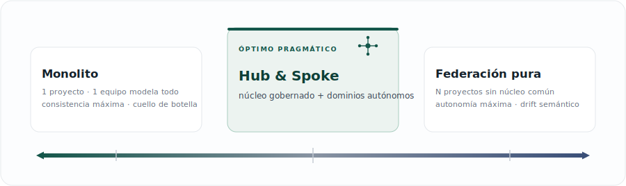
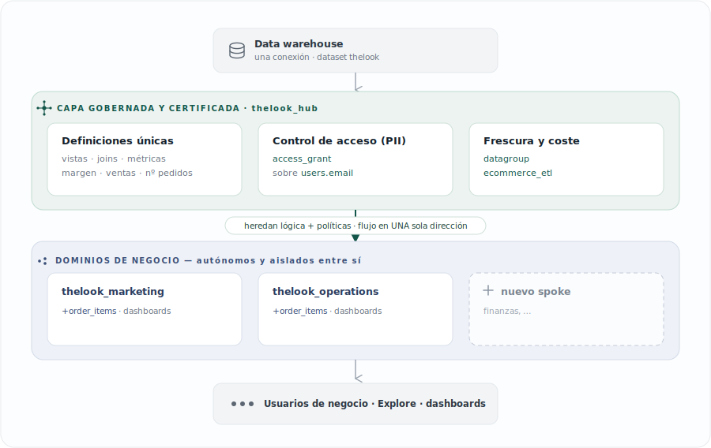
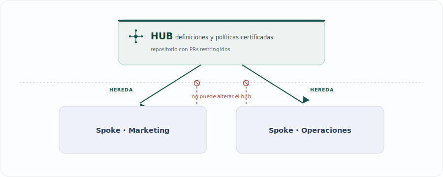

[English](README.en.md) · **Español** · [Français](README.fr.md)

# TheLook · Modelo Hub & Spoke en Looker
### Una capa semántica gobernada: gobernanza por construcción, no por convención

La gobernanza de datos no fracasa por falta de reglas, sino porque las reglas que dependen de la disciplina humana no escalan al ritmo de la autonomía de los equipos. Este proyecto parte de una tesis distinta: **convertir la gobernanza de un proceso que hay que recordar en una propiedad de la arquitectura que no se puede eludir en silencio**. El *hub* concentra las definiciones y políticas certificadas; cada *spoke* (área) las hereda como punto de partida y construye sobre ellas, sin poder contradecirlas de forma accidental ni global. Implementado sobre el dataset `thelook` como implementación de referencia lista para forkear.

---

## El dilema: control frente a autonomía

Toda organización analítica oscila entre dos extremos imperfectos. **Centralizar** el modelado garantiza consistencia, pero convierte al equipo de datos en un cuello de botella y empuja a las áreas hacia el *shadow analytics* (cada quien con su hoja de cálculo). **Descentralizarlo** da velocidad, pero produce deriva semántica —cada equipo redefine "ventas"—, PII gobernada de forma dispersa y métricas irreconciliables entre departamentos.

El problema de diseño interesante no es elegir un extremo, sino **obtener consistencia y autonomía a la vez**. Hub & spoke es la respuesta pragmática a ese dilema sobre una capa semántica como LookML.

---

## El espacio de diseño

Hub & spoke no es la única topología posible: es una elección deliberada dentro de un espectro que va del control máximo a la autonomía máxima.

<p align="center">
  
</p>
<div align="center"><sub>← más control&nbsp;&nbsp;·&nbsp;&nbsp;más autonomía →</sub></div>

El comportamiento de cada modelo frente a las dimensiones que de verdad importan en gobernanza:

| Modelo | Consistencia semántica | Autonomía de equipos | Aislamiento entre áreas | PII no evadible | Coste operativo |
|---|---|---|---|---|---|
| Monolito (1 proyecto) | Alta | Baja | Baja | Alta | Bajo |
| **Hub & Spoke** | **Alta** (en lo certificado) | **Media-alta** | **Alta** | **Alta** | **Medio** |
| Federación pura (N sin hub) | Baja (drift) | Alta | Alta | Baja (dispersa) | Medio |
| Data mesh | Media-alta (contratos) | Alta | Alta | Media (federada) | Alto |

Frente al **data mesh** —un paradigma organizativo donde cada dominio publica datos como producto bajo una gobernanza computacional federada—, hub & spoke puede leerse como su expresión ligera sobre una sola plataforma: el hub *es* la capa de gobernanza computacional y los spokes son los dominios. Para una sola instancia de Looker y una organización mediana-grande, captura la mayor parte del beneficio con una fracción del coste operativo.

---

## Arquitectura de la solución

<p align="center">
  
</p>

---

## La tesis central: gobernanza por construcción

La diferencia que sostiene todo lo demás es sutil pero decisiva. La **gobernanza por convención** —guías de estilo, checklists de PR, "por favor usa el campo certificado"— se degrada porque depende de la vigilancia humana y no tiene punto de aplicación en la costura entre equipos: la divergencia ocurre en silencio (alguien escribe su propio SQL en un *Look*) y la deriva se acumula de forma global.

La **gobernanza por construcción** la sustituye por invariantes que el sistema impone. En este modelo, las definiciones y políticas certificadas son el *default* y la línea base compartida; cualquier divergencia de un spoke es, por diseño:

1. **explícita y visible** en el código de ese spoke —nunca un olvido ni un accidente—,
2. **local** a ese spoke —radio de impacto acotado—, y
3. **incapaz de corromper** el hub o a otra área.

Las políticas dejan de ser un acuerdo y pasan a ser **código**. El control de acceso a `users.email` no puede eludirse por omisión: un spoke no lo redefine, lo hereda ya gobernado; debilitarlo exigiría una sobreescritura explícita y revisable —justo donde la revisión debe concentrarse—, y la decisión de acceso última (el atributo de usuario) la controla el administrador, no el LookML del spoke.

<p align="center">
  
</p>
<div align="center"><sub>El código del hub es de solo lectura para los spokes, que además están aislados entre sí.</sub></div>

---

## Cómo se materializa (la evidencia, en el código)

Cada beneficio de gobernanza está anclado a una pieza concreta del repositorio.

- **Fuente única de verdad para cada métrica.** Margen bruto, ventas y nº de pedidos se definen una vez en `hub/views/order_items.view.lkml` y ambos spokes los consumen sin redefinir. Si la definición cambia, cambia para todos a la vez, desde un único punto auditable con un solo historial de Git. Fin del "tu revenue no cuadra con el mío".
- **PII no evadible, centralizada.** `users.email` lleva `required_access_grants: [can_see_email]` en el hub. Operaciones lo usa en su reporte de pedidos retrasados, pero hereda el candado; ningún área puede exponerlo por su cuenta sin un acto explícito y visible.
- **Radio de impacto acotado + versionado deliberado.** El flujo unidireccional aísla a los spokes entre sí, y cada uno fija la versión del hub que consume (`ref` a un commit SHA) para actualizar de forma controlada. Un experimento de un área nunca rompe las métricas del resto.
- **Frescura y coste como decisión central.** La política de caché y refresco (`datagroup ecommerce_etl`) se define en el hub y se aplica por igual vía `persist_with`: nadie consulta datos obsoletos por accidente ni dispara el warehouse con políticas dispares.
- **Confianza del usuario final.** Cada persona ve solo las explores de su dominio (sin el ruido de los experimentos ajenos) y cada métrica certificada lleva su `description`, de modo que el negocio sabe qué mide y de dónde sale.
- **El equipo central escala sin ser cuello de botella.** Gobierna el núcleo (definiciones, accesos, frescura) y delega en las áreas la lógica de su dominio: control fuerte y autonomía, a la vez.

---

## Costes, límites y anti-patrones

Una elección de arquitectura honesta declara también lo que cuesta y cuándo no aplica.

- **Sobrecarga operativa.** Varios repositorios, credenciales de importación (deploy keys) y el ciclo de *Update Dependencies* añaden fricción frente a un monolito. Es un coste real que solo se paga solo cuando hay varios dominios con necesidades divergentes.
- **Curva de aprendizaje.** Los *refinements* y el orden de los `include` (la explore base debe preceder a su refinement; sin comodines donde el orden importa) exigen formación. Documenta el patrón y forma a los desarrolladores de los spokes.
- **El anti-patrón del "hub obeso".** Subir al hub lógica de un solo dominio reintroduce el acoplamiento que el modelo busca eliminar. Regla: al hub solo asciende lo **transversal y certificado**; una métrica que usa un único equipo vive en su spoke.
- **La tensión del versionado.** Un `ref` de rama propaga cambios al instante (ágil pero frágil); un commit SHA fijo da estabilidad a costa de *upgrades* deliberados. En producción suele preferirse SHA fijo con actualizaciones revisadas.
- **¿Quién gobierna al hub?** El hub no se gobierna solo. Necesita un dueño explícito (un equipo de plataforma o *enablement*), un modelo de contribución (PRs y, para cambios mayores, RFCs) y un compromiso de servicio. Sin ese modelo operativo, degenera en cuello de botella o en abandono: la gobernanza es **socio-técnica**: la arquitectura impone las reglas, pero las personas deciden cuáles.
- **Cuándo NO usarlo.** Con un solo equipo, una instancia naciente o dominios sin semántica compartida, el monolito (o la federación pura) es la elección correcta. El sobrecoste no se justifica hasta que la consistencia entre varios equipos se vuelve un problema tangible.

---

## Cómo está organizado el repositorio

Monorepo didáctico: cada carpeta de primer nivel se convierte en **un proyecto independiente de Looker** y, en producción, en **su propio repositorio de Git**.

| Carpeta | Proyecto Looker | Rol |
|---|---|---|
| `hub/` | `thelook_hub` | Vistas, explore base, gobernanza (PII + caché), constantes |
| `spoke-marketing/` | `thelook_marketing` | Consultas de ventas/marketing + dashboard |
| `spoke-operations/` | `thelook_operations` | Consultas de logística + dashboard |

```
hub/
  manifest.lkml                  project_name + constantes (conexión, dataset)
  thelook_hub.model.lkml         conexión corporativa · access_grant · datagroup
  views/                         vistas base reutilizables (PII gobernada en users.email)
  explores/order_items.explore   explore base + joins (la refinan los spokes)
spoke-marketing/ · spoke-operations/
  manifest.lkml                  remote_dependency -> thelook_hub
  *.model.lkml                   importa el hub + refinements + dashboards
  queries/…                      explore: +order_items { query: … }
  dashboards/…                   dashboards LookML del área
```

---

## Puesta en marcha

### Opción A — Producción (3 repos, recomendado)
1. Forkea este repo y divídelo en tres repositorios (uno por carpeta); el contenido de cada carpeta va en la **raíz** de su repo.
2. Crea **3 proyectos LookML** en Looker y conéctalos por Git a sus repos.
3. **Blinda el hub:** protege su rama y limita los PRs a un grupo reducido de desarrolladores. → Guías por plataforma: **[GitHub](docs/protecting-the-hub.md)** · **[GitLab / Bitbucket](docs/protecting-the-hub-gitlab-bitbucket.md)**.
4. En cada spoke, ajusta la URL del `remote_dependency` (ya incluido) y el `ref` (rama, tag o **commit SHA** para versionado fijo).
5. **Credenciales (repos privados):** en el IDE del spoke, **Settings → Import Credentials**, copia la deploy key SSH y añádela al repo del hub. Valida.
6. Pulsa **Update Dependencies** para traer los archivos del hub (se genera `manifest_lock.lkml`, que **sí** se commitea).
7. Ajusta `connection:` en cada modelo de spoke. Si tu dataset no es `thelook`, sobreescríbelo por spoke con `override_constant: dataset { value: "mi_dataset" }`.
8. Crea el user attribute `can_see_email` (Admin → User Attributes) y ponlo en `yes` solo a quien deba ver emails.
9. Valida y despliega cada spoke.

### Opción B — Una sola instancia (más rápido para demo)
Comenta `remote_dependency` y usa `local_dependency: { project: "thelook_hub" }` en el manifest de cada spoke. El versionado pasa a ser dinámico: los cambios del hub se reflejan al instante, ideal para validar hub y spoke a la vez antes de producción.

---

## Qué ajustar antes de validar
- **Conexión:** `connection:` en cada `*.model.lkml` de spoke.
- **Dataset/esquema:** por defecto `thelook` (en `hub/manifest.lkml`); cámbialo allí o por spoke con `override_constant`.
- **Dialecto SQL:** las funciones de fecha de las vistas (`timestamp_diff`, `current_timestamp`) están escritas para **BigQuery**; ajústalas si usas otro motor.
- **Gobernanza:** crea el user attribute `can_see_email` para que el control de PII surta efecto.

---

## Consultas que ya trae cada spoke

| Spoke | Consulta | Qué responde |
|---|---|---|
| Marketing | `high_value_geos` | Estados con mayor margen bruto (90 días) |
| Marketing | `year_over_year` | Ventas mensuales comparadas interanualmente (4 años) |
| Operaciones | `shipments_status` | Estado del pipeline de envíos por día |
| Operaciones | `inventory_aging` | Volumen de inventario por antigüedad de stock |
| Operaciones | `severely_delayed_orders` | Pedidos en *Processing* > 3 días (usa PII gobernada) |

---

## Añadir un nuevo spoke (p. ej. Finanzas)
Crea `spoke-finance/` con su `manifest.lkml` (`project_name: "thelook_finance"`) importando el hub, un `finance.model.lkml` que incluya las vistas y la explore base del hub (`//thelook_hub/…`) y luego su archivo de refinements con los KPIs del área. El núcleo gobernado no se toca; el espacio de diseño se mantiene íntegro.
